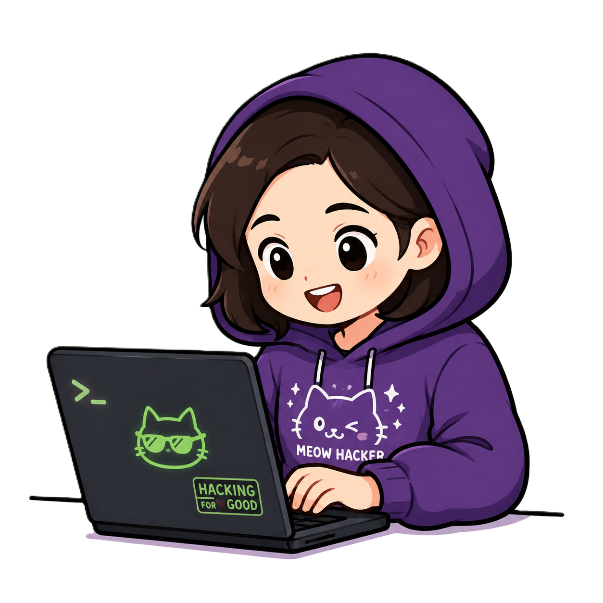

<h1>
  Hi 👋🏻, I'm Elizabeth🐞
  
</h1>
 
<h3>
  
  Computer Engineering Graduate | M.Sc. Student specialized in Cybersecurity
</h3>

Computer Engineer passionate about cybersecurity, backend/web development, and smart databases. I’m currently completing my Master's with a focus on security, looking for my next challenge in the tech world. I'd describe myself as a proactive learner who enjoys problem-solving, picking up new skills quickly, and constantly looking for ways to improve!

  <strong>Open to collaborating on interesting projects ✨</strong>

  

<h3>
   Languages and Tools:
</h3>

  

  

  

